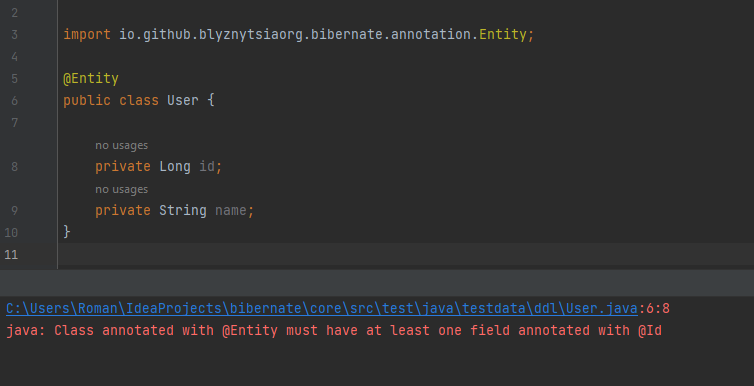
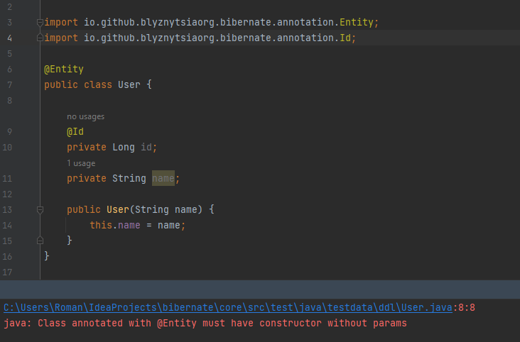
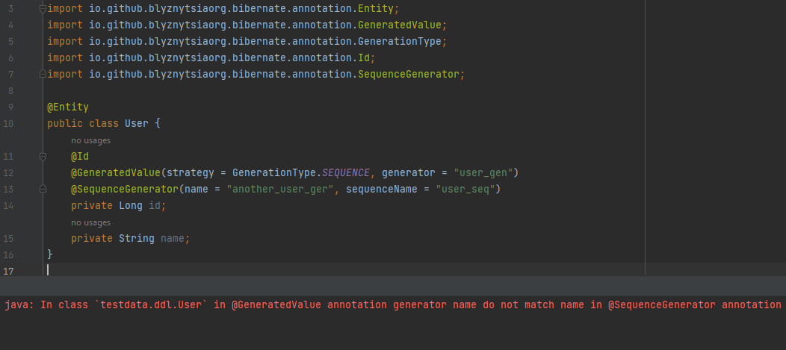
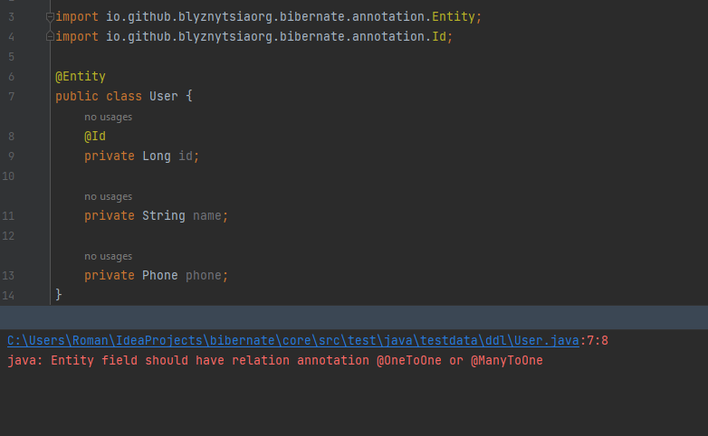

## Annotation Processing Entity Validation

Annotation processor for validating requirements on classes annotated with the `@Entity` annotation. 
This processor ensures compliance with certain standards such as:

- Presence of a field annotated with `@Id`. Error message *'Class annotated with @Entity must have at least one field annotated with @Id'*.

- Existence of a no-args constructor. Error message *'Class annotated with @Entity must have constructor without params'*.

- Consistency of generator names between `@GeneratedValue` and `@SequenceGenerator` annotations. Error message *'In class {} in @GeneratedValue annotation generator name do not match name in @SequenceGenerator annotation'*

- Checks if any field in the entity class is missing a required relation annotation such as `@OneToOne` or `@ManyToOne`.
 Error message *'Entity field should have relation annotation @OneToOne or @ManyToOne'*.

Additionally, it supports the `@IgnoreEntity` annotation to exclude specific classes from the compile validation process.
